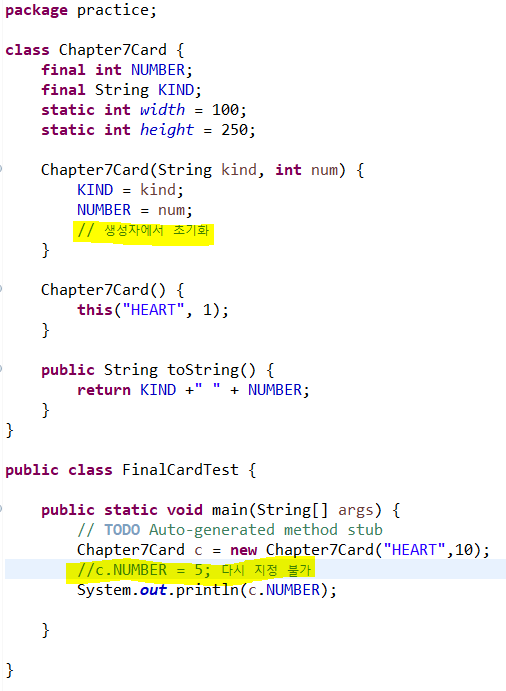
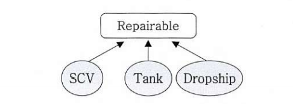

# **자바의 정석 Chapter7**


### 오버라이딩

조건 :

(1) 이름이 같아야 한다.

(2) 매개변수가 같아야 한다.

(3) 반환타입이 같아야한다.

제한 :

(1) 접근제어자는 조상 클래스의 메서드보다 좁은 범위로 변경할 수 없다.

(2) 조상 클래스의 메서드보다 많은 수의 예외를 선언할 수 없다.

vs. 오버로딩

오버로딩은 기존에 없는 새로운 메서드를 추가하는 것

오버라이딩은 조상으로부터 상속받은 메서드의 내용을 변경하는 것

### 패키지

패키지 선언문은 반드시 소스파일에서 주석과 공백을 제외한 첫번째 문장이여야하고, 하나의 소스파일에 단 한번만 선언가능.

모든 클래스는 반드시 하나의 패키지에 포함되어야 함.

소스파일에 자신이 속할 패키지를 지정하지 않은 클래스는 자동으로 이름없는 패키지에 속하게 됨.

### Import

pacakge문 다음에, 클래스 선언문 이전에 위치해야함.

클래스 이름 대신 *을 사용하는 것이 하위패키지의 클래스까지 포함하는 것은 아님.

*System, String 같은 java.lang패키지의 클래스들을 사용할 수 있었던 이유 = 모든 소스파일에 묵시적으로

```java
import java.lang.*;
```

가 명시되어 있었음.

### static import

static 멤버를 호출할 때 클래스 이름을 생략할 수 있다.

```java
import static java.lang.Integer.*; // Integer클래스의 모든 static메서드
```

*하지만 주로 static 클래스는 import 하지 않는다.

### Final 변수



### 접근제어자

private | 같은 클래스

(default) | 같은 패키지

protected | 같은 패키지, 다른 패키지의 자손클래스

public | 접근 제한 없음

### final 클래스

생성자가 private인 클래스는 다른 클래스의 조상이 될 수 없다. 이런 경우 클래스 앞에 final을 추가하여 상속할 수 없는 클래스라는 것을 알리는 것이 좋다.

### 제어자 주의사항

1. 메서드에 static과 abstract를 함께 사용할 수 없다.
2. 클래스에 abstract와 final 을 동시에 사용할 수 없다.
3. abstract 메서드의 접근 제어자가 private일 수 없다.
4. 메서드에 private과 final을 같이 사용할 필요는 없다.

### 다형성

조상타입의 참조변수로 자손타입의 인스턴스를 참조할 수 있다.

자손타입의 참조변수로 조상타입의 인스턴스를 참조할 수 없다.

### 형변환

업캐스팅 : 자손타입 → 조상타입 o (형변환 생략가능)

다운캐스팅 : 조상타입 → 자손타입 o

참조변수의 형변환은 인스턴스에 아무런 영향을 미치지 않는다.

상속관계가 아닌 클래스간의 형변환은 불가하다.

- 가능

```java
Car car = null;
FireEngine fe = new FireEngine();
FireEngine fe2 = null

car = fe;
fe2 = (FireEngine)car;
```

- 불가능 : 조상타입의 인스턴스를 자손타입의 참조변수로 참조하는 것은 허용되지 않는다.

```java
Car car = new Car();
Car car2 = null;
FireEngine fe = null;

fe = (FireEngine)car;
```

### 참조변수와 인스턴스의 연결

멤버변수가 조상 클래스와 자손 클래스에 중복으로 정의된 경우, 조상타입의 참조변수를 사용했을 때는 조상 클래스에 선언된 멤버변수가 사용. 자손타입의 참조변수를 사용했을 때는 자손 클래스에 선언된 멤버변수가 사용.

### Vector클래스

동적으로 크기가 관리되는 객체배열

### 추상클래스

미완성 설계도

하나의 틀

생성자가 있고, 멤버변수와 메서드도 가질 수 있음

```java
abstract class 클래스이름 {}
```

### 추상메서드

선언부만 존재

```java
abstract 리턴타입 메서드이름 ();
```

추상클래스 → 상속받은 자손클래스 : 오버라이딩을 통해 조상인

추상클래스의 추상메서드를 모두 구현해야함

```java
abstract class Player {
	abstract void play(int pos);
	abstract void stop();
}
class AudioPlayer extends Player {
	void play (int pos) {}
	void stop() {}
}
abstract class AbstractPlayer extends Player {
	void play (int pos) {}
}
```

### 인터페이스

장점:

개발시간을 단축

표준화가 가능

서로 관계없는 클래스들에게 관계를 맺어줄 수 있다

독립적인 프로그래밍이 가능

구현방법:

```java
interface Repairable {}
class SCV extends GroundUnit implements Repairable {}
class Tank extends GroundUnit implements Repairable {}
class Dropship extends AirUnit implements Repairable {}
```



사용방법:

```java
package practice;

public class RepairableTest {

	public static void main(String[] args) {
		// TODO Auto-generated method stub
		Tank tank = new Tank();
		Dropship dropship = new Dropship();

		Marine marine = new Marine();
		SCV scv = new SCV();

		scv.repair(tank);
		scv.repair(dropship);
		// scv.repair(marine); -> error. repairable 인터페이스를 구현하지 않았기 때문

	}

}

interface Repairable{}

class GroundUnit extends Unit {
	GroundUnit(int hp) {
		super(hp);
	}
}

class AirUnit extends Unit {
	AirUnit(int hp) {
		super(hp);
	}
}

class Unit {
	int hitPoint;
	final int MAX_HP;
	Unit(int hp) {
		MAX_HP = hp;
	}
}

class Tank extends GroundUnit implements Repairable {
	Tank() {
		super(150);
		hitPoint = MAX_HP;
	}

	public String toString() {
		return "Tank";
	}
}

class Dropship extends AirUnit implements Repairable {
	Dropship() {
		super(125);
		hitPoint = MAX_HP;
	}

	public String toString() {
		return "Dropship";
	}
}

class Marine extends GroundUnit {
	Marine() {
		super(40);
		hitPoint = MAX_HP;
	}
}

class SCV extends GroundUnit implements Repairable {
	SCV() {
		super(60);
		hitPoint = MAX_HP;
	}

	void repair(Repairable r) {
		if (r instanceof Unit) {
			Unit u = (Unit)r;
			while(u.hitPoint!=u.MAX_HP) {
				u.hitPoint++;
			}

			System.out.println(u.toString()+"의 수리가 끝났습니다.");
		}
	}
}
```

### 인터페이스의 이해

클래스를 사용하는 쪽 ↔ 클래스를 제공하는 쪽

메서드를 사용하는 쪽에서는 사용하려는 메서드의 선언부만 알면 됨.

메서드를 제공하는 쪽은 오직 실제로 사용하는 클래스에 영향을 주는 게 아니라 인터페이스에만 영향을 미친다.

```java
package practice;

class A {
	void autoPlay(I i) {
		i.play();
	}
}

interface I {
	public abstract void play();
}

class B implements I {
	public void play() {
		System.out.println("play in B class");
	}
}

class C implements I {
	public void play() {
		System.out.println("play in C class");
	}
}

public class InterfaceTest2 {
	public static void main(String[] args) {
		A a = new A();
		a.autoPlay(new B());
		a.autoPlay(new C());
	}
}

/**
 * result :
 * play in B class
 * play in C class
 */

```

* 인터페이스 vs 추상클래스

| 인터페이스   |      추상클래스      |
|----------|:-------------:|
| 몸통x |  몸통o |
| implements로 상속 |    extends로 상속   |
| 다중 상속 가능 | 하나만 상속 가능 |


### 디폴트 메서드 충돌 해결규칙

1. 여러 인터페이스의 디폴트 메서드 간의 충돌
→ 인터페이스를 구현한 클래스에서 디폴트 메서드를 오버라이딩해야한다.
2. 디폴트 메서드와 조상 클래스의 메서드간의 충돌
→ 조상 클래스의 메서드가 상속되고, 디폴트 메서드는 무시된다.

### 내부 클래스

내부 클래스는 내부 클래스를 감싸고 있는 외부 클래스를 제외하고 다른 클래스에서 잘 사용되지 않은 것이여야한다.

선언 위치에 따라 인스턴스 클래스, 스태틱 클래스, 지역 클래스, 익명 클래스 로 나뉜다.

```java
class Outer {
	class InstanceInner {}
	static class StaticInner {}

	void myMethod() {
		class LocalInner{}
	}
}
```

```java
package practice;

public class InnerEx1 {

	class InstanceInner {
		int iv = 100;
		//static int cv = 100;
		final static int CONST = 100;

		static class StaticInner {
			int iv = 200;
			static int cv = 200;
		}

		void myMethod() {
			class LocalInner {
				int iv = 300;
				//static int cv = 300;
				final static int CONST = 300;
			}
		}

		public static void main(String[] args) {
			// TODO Auto-generated method stub
			System.out.println(InstanceInner.CONST);
			Sys
tem.out.println(StaticInner.cv);

		}
	}

}
```

⇒ 스태틱 클래스만 static 멤버를 가질 수 있음. 단, final과 static이 동시에 붙은 변수는 상수이기 때문에 허용

```java
package practice;

public class InnerEx2 {
	class InstanceInner {}
	static class StaticInner{}

	// 인스턴스멤버간에는 서로 직접 접근 가능
	InstanceInner iv = new InstanceInner();

	// static멤버간에는 서로 직접 접근 가능
	static StaticInner cv = new StaticInner();

	static void staticMethod() {
		//static메서드에서 인스턴스멤버에 직접 접근할 수 없다.
		//InstanceInner obj1 = new InstanceInner();
		StaticInner obj2 = new StaticInner();

		// 굳이 접근하려면 아래처럼 외부클래스를 먼저 생성하여 생성
		InnerEx2 outer = new InnerEx2();
		InstanceInner obj = outer.new InstanceInner();
	}

	void instanceMethod() {
		//인스턴스 메서드에서는 인스턴스멤버, static멤버 모두 접근 가능하다.
		InstanceInner obj1 = new InstanceInner();
		StaticInner obj2 = new StaticInner();
		//LocalInner lv = new LocalInner();
	}

	void myMethod() {
		class LocalInner {}
		LocalInner lv = new LocalInner();
	}

}-
```

→ static메서드에서 인스턴스멤버에 직접 접근할 수 없다.

→ 인스턴스 메서드에서는 인스턴스멤버, static멤버 모두 접근 가능하다.

```java
package practice;

public class InnerEx3 {
	private int outerIv = 0;
	static int outerCv = 0;

	class InstanceInner {
		// 외부 클래스의 private멤버도 접근가능하다.
		int iiv = outerIv;
		int iiv2 = outerCv;

	}

	static class StaticInner {

		// 스태틱 클래스는 외부 클래스의 인스턴스멤버에 접근할 수 없다.
		//int siv = outerIv;
		static int scv = outerCv;
	}

	void myMethod() {
		int lv = 0;
		final int LV = 0;

		class LcoalInner {
			int liv = outerIv;
			int liv2 = outerCv;

			int liv3 = lv;
			int liv4 = LV;
		}
	}
}
```

→ 외부 클래스의 private멤버도 접근가능

```java
package practice;

class Outer {
	class InstanceInner {
		int iv = 100;
	}

	static class StaticInner {
		int iv = 200;
		static int cv = 300;
	}

	void myMethod () {
		class LocalInner {
			int iv = 400;
		}
	}
}

public class InnerEx4 {

	public static void main(String[] args) {
		// TODO Auto-generated method stub

		//인스턴스클래스의 인스턴스를 생성하려면 외부 클래스의 인스턴스를 먼저 생성해야한다.
		Outer oc = new Outer();
		Outer.InstanceInner ii = oc.new InstanceInner();

		//스태틱 내부 클래스의 인스턴스는 외부 클래스를 먼저 생성하지 않아도 된다.
		Outer.StaticInner si = new Outer.StaticInner();

	}

}
```

→ 인스턴스클래스의 인스턴스를 생성하려면 외부 클래스의 인스턴스를 먼저 생성해야한다.

```java
package practice;

class Outer5 {
	int value = 10;

	class Inner {
		int value = 20;
		void method1() {
			int value = 30;

			System.out.println(this.value);
			System.out.println(Outer5.this.value);
		}
	}
}

public class InnerEx5 {
	public static void main (String args[]) {
		Outer5 outer = new Outer5();
		Outer5.Inner inner = outer.new Inner();
		inner.method1();
	}
}
```

→ 내부 클래스와 외부 클래스에 선언된 변수의 이름이 같을 때 변수 앞에 this 또는 외부 클래스명.this 를 붙여서 서로 구별할 수 있음.

### 익명 클래스

일회용 클래스

생성자X

둘 이상의 인터페이스를 구현할 수 X

```java
package practice;

public class InnerEx6 {
	Object iv = new Object() { void method() {}; }; //익명 클래스
	static Object cv = new Object() { void method() {} }; // 익명 클래스

	void myMethod() {
		Object lv = new Object() { void method() {} }; // 익명 클래스
	}
}
```
